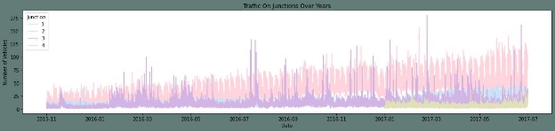
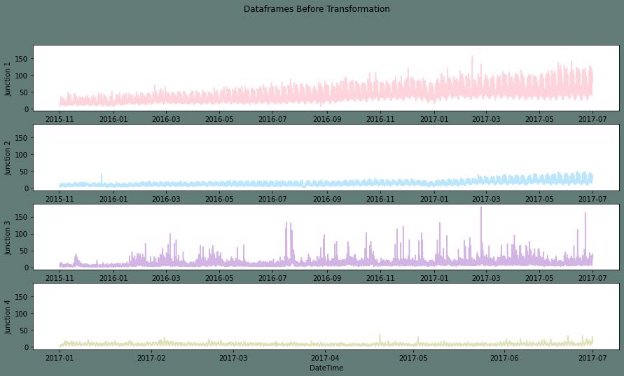
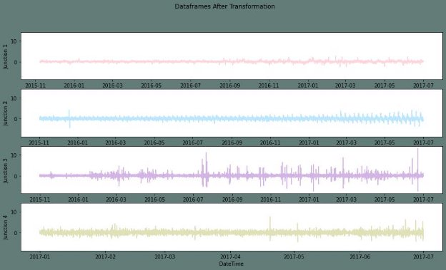
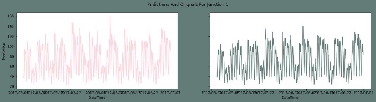
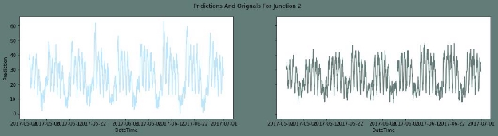
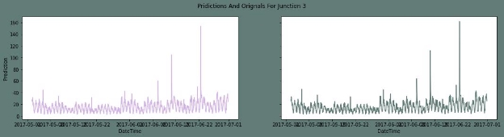
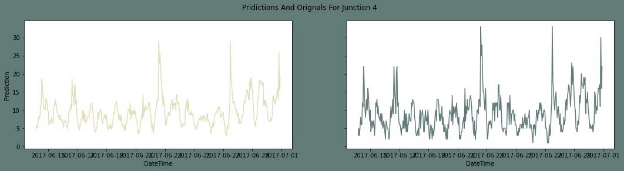

# A Traffic Prediction Model for Predicting Junction Flow 

Traffic is one of those annoying problems that affect many of us living in urban settings. One of the causes of traffic is the increase in urban populations. While the infrastructure is old and can only accommodate a limited population there is an influx of residents in search of livelihood and opportunities. 

Traffic congestions lead to an increased in the combustion of fuel. It further increases the carbon emissions causing air pollution. It also costs time and money. INRIX's, a transportation analytics and connected car services, 2020 report found that on average, Americans lost 99 hours a year due to congestion, costing them nearly 88 billion dollars in 2019, an average of 1,377 dollars per year. From 2017 to 2019 the average time lost by American drivers has increased by two hours as economic and urban growth continues.   

In this project, I will be exploring the dataset of four junctions and built a model to predict traffic on the same. This could potentially help in solving the traffic congestion problem by providing a better understanding of traffic patterns that will further help in building an infrastructure to eliminate the problem. 

## **Loading Data** 

## **About the data** 

This dataset is a collection of numbers of vehicles at four junctions at an hourly frequency. The CSV file provides four features: 

- DateTime 
- Junctions 
- Vehicles 
- ID 

The sensors on each of these junctions were collecting data at different times, hence the traffic data from different time periods. Some of the junctions have provided limited or sparse data. 

## **Data Exploration** 

- Pharsing dates 
- Ploting timeseris 
- Feature engineering for EDA 

## **Noticeable information in the above plot:** 

- It can be seen here that the first junction is visibly having an upward trend. 
- The data for the fourth junction is sparse starting only after 2017 
- Seasonality is not evident from the above plot, So we must explore datetime composition to figure out more about it. 

## **Feature Engineering** 

At this step, I am creating a few new features out of DateTime. Namely: 

- Year 
- Month 
- Date in the given month 
- Days of week 
- Hour 

## **Exploratory Data Analysis** 

Plotting the newly created features

## **From the above plot following things can be concluded:** 

- Yearly, there has been an upward trend for all junctions except for the fourth junction. As we already established above that the fourth junction has limited data and that don't span over a year. 
- We can see that there is an influx in the first and second junctions around June. I presume this may be due to summer break and activities around the same. 
- Monthly, throughout all the dates there is a good consistency in data. 
- For a day, we can see that are peaks during morning and evening times and a decline during night hours. This is as per expectation. 
- For weekly patterns, Sundays enjoy smoother traffic as there are lesser vehicles on roads. Whereas Monday to Friday the traffic is steady. 

# **Data Transformation And Preprocessing** 

## **In this step I will be following the subsequent order:** 

- Creating different frames for each Junction and plotting them 
- Transforming the series and plotting them 
- Performing the Augmented Dickey-Fuller test to check the seasonality of transformed series 
- Creating test and train sets 

## **Steps for Transforming:**

- Normalizing 
- Differencing 

In accordance with the above observations, Differencing to eliminate the seasonality should be performed as follows: 

- For Junction one, I will be taking a difference of weekly values. 
- For junction two, The difference of consecutive days is a better choice 
- For Junctions three and four, the difference of the hourly values will serve the purpose. 

## **Plots of Transformed Dataframe**

The plots above seem linear. To ensure they are Stationary I will be performing an Augmented Dickey-Fuller test. 

The Augmented Dickey-Fuller (ADF) test is a statistical test used to determine whether a time series is stationary or not. It tests the null hypothesis that a unit root is present in a time series sample. The alternative hypothesis is different depending on which version of the test is used, but is usually stationarity or trend-stationarity. The ADF test is one of the most commonly used statistical tests when it comes to analyzing the stationarity of a series. 

In simpler terms, it helps us understand whether a time series has a trend or not. If there is no trend, then it is said to be stationary. 

## **Now that the data is stationary, preprocessing the data for the neural net by:** 

- Splitting the test train sets 
- Assigning X as features and y as target 
- Reshaping data for neural net 

## **Model Building** 

For this project, I have settled to use Gated Recurrent Unit (GRU). In this section, I am creating a function for the neural net to call on and fit the data frames for all four junctions. 

## **A short introduction for (GRU)** 

A Gated Recurrent Unit (GRU) is a type of Recurrent Neural Network (RNN) architecture that was introduced as a simpler alternative to Long Short-Term Memory (LSTM) networks. GRU networks process sequential data such as time series or natural language by bypassing the hidden state from one time step to the next. The hidden state is a vector that captures the information from the past time steps relevant to the current time step. 

## **Fitting The Model** 

Now, I will be fitting the transformed training sets of four junctions to the model created and compare them to the transformed test sets. 

 **Fitting the first junction and plotting the predictions and test set.** 

**Fitting the second junction and plotting the predictions and test set** 

**Fitting the fourth junction and plotting the predictions and test set** 

**Fitting the fourth junction and plotting the predictions and testset** 

## **The results of the model** 

The Root Mean Square Error is quite a subjective marker for evaluating the performance. The Root Mean Square Error (RMSE) tells us how concentrated the data is around the line of best fit. It is a measure of how spread out the residuals are. Residuals are a measure of how far from the regression line data points are. The RMSE value should be as low as possible. A lower RMSE value indicates that the predicted values are closer to the actual values. Thus, in this project, I am including the outcome plots as well.

## **Inversing The Transformation of Data** 

In this section, I will be inversing transforms that I applied to the datasets to remove the seasonality and trends. Performing this step will make the predictions get back on the accurate scale. Time series datasets may contain trends and seasonality, which may need to be removed prior to modeling. 

Trends can result in a varying mean over time, whereas seasonality can result in a changing variance over time, both which define a time series as being non-stationary. Stationary datasets are those that have a stable mean and variance, and are in turn much easier to model.

**the inverse transform on the first junction** 

**the inverse transform on the second junction**

**The inverse transform on the third junction**

**The inverse transform on the fourth junction**

# Summary 

In this project, I trained a GRU Neural network to predicted the traffic on four junctions. I used a normalization and differencing transform to achieve a stationary timeseries. As the Junctions vary in trends and seasonality, I took different approach for each junction to make it stationary. I applied the root mean squared error as the evaluation metric for the model. In addition to that I plotted the Predictions alongside the original test values. Take always from the data analysis: 

The Number of vehicles in Junction one is rising more rapidly compared to junction two and three. The sparsity of data in junction four bars me from making any conclusion on the same. 

The Junction one's traffic has a stronger weekly seasonality as well as hourly seasonality. Whereas other junctions are significantly linear. 
